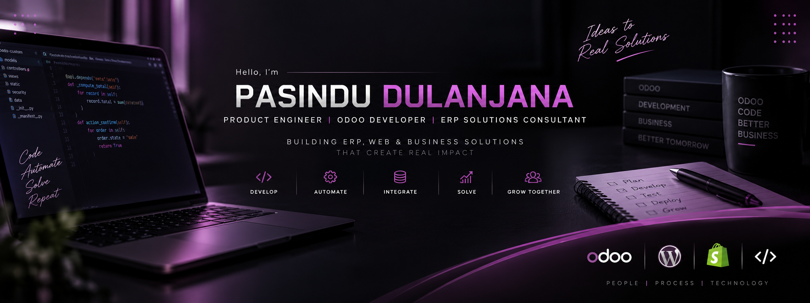

 

## 👨‍💻 About Me

I'm a **Product Engineer and Software Engineering graduate** focused on building practical business solutions through **Odoo development, ERP customization, system integrations, web/mobile engineering, and software quality assurance**.

- 💼 Working as a **Product Engineer**
- ⚙️ Specialized in **Odoo Development & ERP Customization**
- 🏢 Interested in **ERP Solution Design & Business Process Automation**
- 🔌 Building **REST API & Third-Party System Integrations**
- 🌐 Experienced in **Web & Mobile Application Development**
- 🧪 Background in **Software QA & Testing**
- ☁️ Hands-on experience with **Odoo.sh deployment and maintenance**

---

## 🚀 What I Do

<table>
<tr>
<td width="50%" valign="top">

### ⚙️ ERP & Odoo

- Odoo Development & Customization
- ERP Workflow Implementation
- POS & Retail Solutions
- Business Process Automation
- Odoo.sh
- API & Third-Party Integrations

</td>

<td width="50%" valign="top">

### 💻 Software Engineering

- Web Application Development
- Mobile Application Development
- Backend Development
- REST API Development
- System Integration
- Software QA & Testing

</td>
</tr>
</table>

---

## 🛠️ Technology Stack

### 🏢 ERP & Business Platforms

### ⚙️ Backend

### 🎨 Frontend

### 📱 Mobile

### 🗄️ Database

### 🔧 Tools

---

## 📊 GitHub Activity

---

## 💼 Professional Focus

`ERP Solution Design` • `Odoo Development` • `ERP Customization` • `Business Process Automation` • `API Integration` • `Web & Mobile Engineering` • `Software Quality Assurance`

---

## 🌱 Currently

- 🔭 Working on **ERP & Odoo-based business solutions**
- 📚 Strengthening **Odoo Architecture, Python, PostgreSQL, JavaScript & OWL**
- 🤖 Exploring **AI-Assisted Software Development**
- 💡 Building practical software solutions for **real-world business problems**

---

## 🤝 Let's Connect

 

### 💜 Develop • Automate • Integrate • Solve

**Open to Odoo / ERP and Software Engineering opportunities.**

